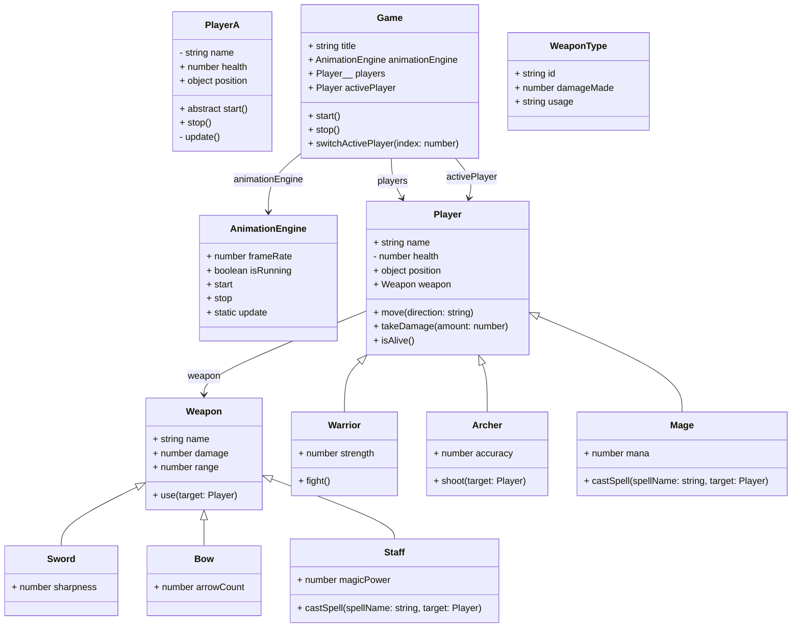

# DSL Input
```yaml
PlayerA:
	props:
		p name: string = 'mySecretName'
		health: number = 100
		position: {
			x: number = 0
			y: number = 0
			}
	methods:
		a start()
			console.log(`Starting player with health ${ this.health }' `)
		stop()
			console.log(`Stopping player with health ${ this.health - 20 } `)
		p update()
			this.health -= 1

AnimationEngine:
	props:
		frameRate: number = 60
		isRunning: boolean = false
	methods:
		start
		stop
		s update

Weapon:
	props:
		name: string
		damage: number = 10
		range: number = 1
	methods:
		use(target: Player)

Sword > Weapon:
	props:
		sharpness: number = 50
		methods:
		slash(target: Player)

Bow > Weapon:
	props:
		arrowCount: number = 20
	methods:
	shoot(target: Player)

Staff > Weapon:
	props:
		magicPower: number = 100
	methods:
		castSpell(spellName: string, target: Player)

Player:
	props:
		name: string
		p health: number = 100
		position: {
			x: number = 0
			y: number = 0
			}
		weapon: Weapon = null
	methods:
		move(direction: string)
		takeDamage(amount: number)
		isAlive()

Warrior > Player:
	props:
		strength: number = 10
	methods:
		fight()

Archer > Player:
	props:
		accuracy: number = 75
	methods:
		shoot(target: Player)

Mage > Player:
	props:
		mana: number = 100
	methods:
		castSpell(spellName: string, target: Player)

Game:
	props:
		title: string = "My Game"
		animationEngine: AnimationEngine
		players: Player[] = []
		activePlayer: Player = null
	methods:
		start()
		stop()
		switchActivePlayer(index: number)

functions:
	init()
	shutdown()

schema WeaponType:
	props:
		id: string
		damageMade: number
		usage: string
```

# Parsed JSON
```json
{
  "classes": {
    "PlayerA": {
      "baseClass": null,
      "props": [
        {
          "name": "name",
          "type": "string",
          "default": "'mySecretName'",
          "modifiers": {
            "private": true
          }
        },
        {
          "name": "health",
          "type": "number",
          "default": "100"
        },
        {
          "name": "position",
          "type": "object",
          "typeProps": [
            {
              "name": "x",
              "type": "number",
              "typeProps": null,
              "default": "0"
            },
            {
              "name": "y",
              "type": "number",
              "typeProps": null,
              "default": "0"
            }
          ],
          "default": null
        }
      ],
      "parameters": [],
      "methods": [
        {
          "signature": "start()",
          "body": "\tconsole.log(`Starting player with health ${ this.health }' `)",
          "modifiers": {
            "abstract": true
          }
        },
        {
          "signature": "stop()",
          "body": "\tconsole.log(`Stopping player with health ${ this.health - 20 } `)"
        },
        {
          "signature": "update()",
          "body": "\tthis.health -= 1\n",
          "modifiers": {
            "private": true
          }
        }
      ]
    },
    "AnimationEngine": {
      "baseClass": null,
      "props": [
        {
          "name": "frameRate",
          "type": "number",
          "default": "60"
        },
        {
          "name": "isRunning",
          "type": "boolean",
          "default": "false"
        }
      ],
      "parameters": [],
      "methods": [
        {
          "signature": "start",
          "body": ""
        },
        {
          "signature": "stop",
          "body": ""
        },
        {
          "signature": "update",
          "body": "",
          "modifiers": {
            "static": true
          }
        }
      ]
    },
    "Weapon": {
      "baseClass": null,
      "props": [
        {
          "name": "name",
          "type": "string",
          "default": null
        },
        {
          "name": "damage",
          "type": "number",
          "default": "10"
        },
        {
          "name": "range",
          "type": "number",
          "default": "1"
        }
      ],
      "parameters": [],
      "methods": [
        {
          "signature": "use(target: Player)",
          "body": ""
        }
      ]
    },
    "Sword": {
      "baseClass": "Weapon",
      "props": [
        {
          "name": "sharpness",
          "type": "number",
          "default": "50"
        }
      ],
      "parameters": [],
      "methods": []
    },
    "Bow": {
      "baseClass": "Weapon",
      "props": [
        {
          "name": "arrowCount",
          "type": "number",
          "default": "20"
        }
      ],
      "parameters": [],
      "methods": []
    },
    "Staff": {
      "baseClass": "Weapon",
      "props": [
        {
          "name": "magicPower",
          "type": "number",
          "default": "100"
        }
      ],
      "parameters": [],
      "methods": [
        {
          "signature": "castSpell(spellName: string, target: Player)",
          "body": ""
        }
      ]
    },
    "Player": {
      "baseClass": null,
      "props": [
        {
          "name": "name",
          "type": "string",
          "default": null
        },
        {
          "name": "health",
          "type": "number",
          "default": "100",
          "modifiers": {
            "private": true
          }
        },
        {
          "name": "position",
          "type": "object",
          "typeProps": [
            {
              "name": "x",
              "type": "number",
              "typeProps": null,
              "default": "0"
            },
            {
              "name": "y",
              "type": "number",
              "typeProps": null,
              "default": "0"
            }
          ],
          "default": null
        },
        {
          "name": "weapon",
          "type": "Weapon",
          "default": "null"
        }
      ],
      "parameters": [],
      "methods": [
        {
          "signature": "move(direction: string)",
          "body": ""
        },
        {
          "signature": "takeDamage(amount: number)",
          "body": ""
        },
        {
          "signature": "isAlive()",
          "body": ""
        }
      ]
    },
    "Warrior": {
      "baseClass": "Player",
      "props": [
        {
          "name": "strength",
          "type": "number",
          "default": "10"
        }
      ],
      "parameters": [],
      "methods": [
        {
          "signature": "fight()",
          "body": ""
        }
      ]
    },
    "Archer": {
      "baseClass": "Player",
      "props": [
        {
          "name": "accuracy",
          "type": "number",
          "default": "75"
        }
      ],
      "parameters": [],
      "methods": [
        {
          "signature": "shoot(target: Player)",
          "body": ""
        }
      ]
    },
    "Mage": {
      "baseClass": "Player",
      "props": [
        {
          "name": "mana",
          "type": "number",
          "default": "100"
        }
      ],
      "parameters": [],
      "methods": [
        {
          "signature": "castSpell(spellName: string, target: Player)",
          "body": ""
        }
      ]
    },
    "Game": {
      "baseClass": null,
      "props": [
        {
          "name": "title",
          "type": "string",
          "default": "\"My Game\""
        },
        {
          "name": "animationEngine",
          "type": "AnimationEngine",
          "default": null
        },
        {
          "name": "players",
          "type": "Player[]",
          "default": "[]"
        },
        {
          "name": "activePlayer",
          "type": "Player",
          "default": "null"
        }
      ],
      "parameters": [],
      "methods": [
        {
          "signature": "start()",
          "body": ""
        },
        {
          "signature": "stop()",
          "body": ""
        },
        {
          "signature": "switchActivePlayer(index: number)",
          "body": ""
        }
      ]
    }
  },
  "schemas": {
    "WeaponType": {
      "props": [
        {
          "name": "id",
          "type": "string",
          "default": null
        },
        {
          "name": "damageMade",
          "type": "number",
          "default": null
        },
        {
          "name": "usage",
          "type": "string",
          "default": null
        }
      ]
    }
  },
  "functions": [
    "init()",
    "shutdown()"
  ]
}
```

# Mermaid Diagram


# Generated JS
```js
let logger = true;
function log(message, ...args) {
	if (logger) {
		const now = new Date();
		const timestamp = now.toLocaleTimeString('en-US', { hour12: false });
		console.log(`[${timestamp}] ${message}`, ...args);
	}
}

class PlayerA {
	#name;
	#update;
	constructor(args = {}) {
		this.#name = 'mySecretName';
		this.health = args.health ?? 100;
		this.position = args.position ?? { x: 0, y: 0 };
	}
	start() {
		throw new Error("Method start() must be implemented in child classes");
	}
	stop() {
		log("Calling stop from PlayerA");
		console.log(`Stopping player with health ${ this.health - 20 } `)
	}
	#update() {
		log("Calling update from PlayerA");
		this.health -= 1
		
	}
}

class AnimationEngine {
	constructor(args = {}) {
		this.frameRate = args.frameRate ?? 60;
		this.isRunning = args.isRunning ?? false;
	}
	start() {
		log("Calling start from AnimationEngine");
		// TODO Implement start
	}
	stop() {
		log("Calling stop from AnimationEngine");
		// TODO Implement stop
	}
	static update() {
		log("Calling update from AnimationEngine");
		// TODO Implement update
	}
}

class Weapon {
	constructor(args = {}) {
		this.name = args.name ?? null;
		this.damage = args.damage ?? 10;
		this.range = args.range ?? 1;
	}
	use(target) {
		log("Calling use from Weapon", target);
		// TODO Implement use
	}
}

class Sword extends Weapon {
	constructor(args = {}) {
		super(args);
		this.sharpness = args.sharpness ?? 50;
	}
}

class Bow extends Weapon {
	constructor(args = {}) {
		super(args);
		this.arrowCount = args.arrowCount ?? 20;
	}
}

class Staff extends Weapon {
	constructor(args = {}) {
		super(args);
		this.magicPower = args.magicPower ?? 100;
	}
	castSpell(spellName, target) {
		log("Calling castSpell from Staff", spellName, target);
		// TODO Implement castSpell
	}
}

class Player {
	#health;
	constructor(args = {}) {
		this.name = args.name ?? null;
		this.#health = 100;
		this.position = args.position ?? { x: 0, y: 0 };
		this.weapon = args.weapon ?? null;
	}
	move(direction) {
		log("Calling move from Player", direction);
		// TODO Implement move
	}
	takeDamage(amount) {
		log("Calling takeDamage from Player", amount);
		// TODO Implement takeDamage
	}
	isAlive() {
		log("Calling isAlive from Player");
		// TODO Implement isAlive
	}
}

class Warrior extends Player {
	constructor(args = {}) {
		super(args);
		this.strength = args.strength ?? 10;
	}
	fight() {
		log("Calling fight from Warrior");
		// TODO Implement fight
	}
}

class Archer extends Player {
	constructor(args = {}) {
		super(args);
		this.accuracy = args.accuracy ?? 75;
	}
	shoot(target) {
		log("Calling shoot from Archer", target);
		// TODO Implement shoot
	}
}

class Mage extends Player {
	constructor(args = {}) {
		super(args);
		this.mana = args.mana ?? 100;
	}
	castSpell(spellName, target) {
		log("Calling castSpell from Mage", spellName, target);
		// TODO Implement castSpell
	}
}

class Game {
	constructor(args = {}) {
		this.title = args.title ?? "My Game";
		this.animationEngine = args.animationEngine ?? new AnimationEngine();
		this.players = args.players ?? [];
		this.activePlayer = args.activePlayer ?? null;
	}
	start() {
		log("Calling start from Game");
		// TODO Implement start
	}
	stop() {
		log("Calling stop from Game");
		// TODO Implement stop
	}
	switchActivePlayer(index) {
		log("Calling switchActivePlayer from Game", index);
		// TODO Implement switchActivePlayer
	}
}

// Schema: WeaponType
const WeaponType = {
	id: null,
	damageMade: null,
	usage: null,
};

function init() {
	log("Calling init from global function");
	// TODO Implement init
}

function shutdown() {
	log("Calling shutdown from global function");
	// TODO Implement shutdown
}

```